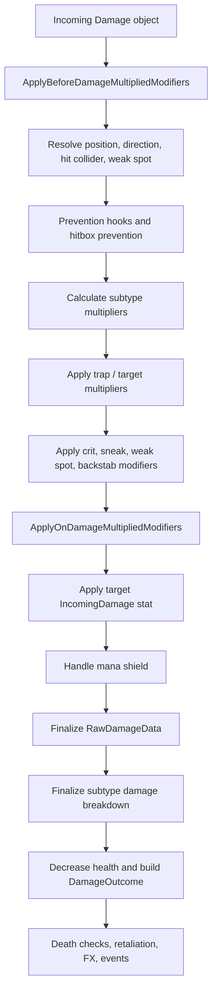

# Combat and Resistance Systems in Tainted Grail

## 2026-07-25 Update: Authored Enemy Data

This report remains useful for the managed combat pipeline in `TG.Main.dll`: damage subtypes, armor, `DamageReceivedMultiplierData`, `HealthElement`, block/parry interception, status scaffolding, and difficulty knobs.

For actual NPC resistances and weaknesses, use [npc-template-resistance-research-report.md](npc-template-resistance-research-report.md) and [../steel-and-bone-enemies.md](../steel-and-bone-enemies.md) as the newer sources. The later template audit confirms that authored `NpcTemplate.damageReceivedMultipliers` contain a real but selective resistance system: skeleton blunt weakness, Drowner Fire resistance, Red Death Fire weakness/Poison resistance, Sarras Cold resistance clusters, and per-template construct elemental polarities. It also confirms that broad rules such as all undead, all ghosts, all Wyrd enemies, all aquatic enemies, or all bosses sharing one resistance package are not supported by the exported template data.

## Executive summary

The supplied `TG.Main.dll` confirms that **Tainted Grail: The Fall of Avalon** uses a fairly rich managed combat model built around a `Damage` object, structured `DamageParameters`, subtype-partitioned damage composition, subtype-based received-damage multipliers, and a centralized `HealthElement` damage pipeline. Publicly, the game is a first-person open-world action RPG built around melee weapons, shields, bows, magic, throwables, and branching build choices, which aligns closely with the combat abstractions visible in the assembly. citeturn1search0

The most important reverse-engineered conclusion is this: **the DLL does not expose a simple hardcoded “enemy resistances/weaknesses table.”** Instead, it models incoming mitigation and vulnerability primarily through **`DamageReceivedMultiplierData`**, keyed by **`DamageSubType`**, and applied during `DamageTypeDataBase.CalculateMultiplier`. In other words, the managed combat core already supports resistances, weaknesses, and immunities as **multipliers on damage subtypes**, rather than as bespoke boolean flags or race-family lookup tables.

At a high confidence level, the managed logic confirms all of the following:

| Confirmed finding | Evidence from static inspection of `TG.Main.dll` | Modding implication |
|---|---|---|
| Damage is split into **types** and **subtypes** | `DamageType`, `DamageSubType`, `DamageTypeDataBase`, `DamageTypeDataPart` | New defensive mechanics should hook into subtype-aware paths, not only raw numbers |
| Resistance/weakness logic is **multiplier-based** | `DamageReceivedMultiplierDataBase.GetMultiplierForSubtype` | Weakness = `> 1`, resistance = `< 1`, immunity = `0` |
| Armor mitigation is **global and capped** | `GetArmorDamageReduction(armor/100 clamped to 0.95)` | Armor is not the right place to emulate elemental resistance |
| Blocking and parrying are **pre-health-loss interception systems** | `AIBlock.OnTakingDamage`, `HeroBlock.OnTakingDamage`, `HeroParry.OnTakingDamage` | Defensive mods must decide whether they want to act before or after those systems |
| Status susceptibility is **data-driven** | `StatusStatsValues`, `StatusStats`, `invulnerableToStatuses` references | Status resistance mods should likely piggyback on thresholds and template immunities |
| Difficulty exposes combat-facing knobs | `Difficulty` rich enum includes `DamageDealt`, `DamageReceived`, `StaminaUsage`, `ManaUsage`, etc. | Difficulty-aware mods can integrate with existing balance assumptions |

What the DLL **does not** cleanly confirm, at least from this pass, is a centralized managed table for enemy-family rules such as undead, golems, or bosses. The later NPC-template audit confirms that authored enemy data does contain per-template resistance and weakness multipliers, so this statement should be read as "not centralized in the managed combat kernel," not "absent from the game data."

That distinction matters because official post-launch balance patches show the studio actively rebalancing late-game damage scaling, crit stacking, and mana-shield behavior. Version 1.20 in March 2026 explicitly introduced broad balance changes because players were becoming too strong in late Act 2 and Act 3; the same announcement describes optional soft caps and mana-shield changes. Earlier, version 1.1.0a removed Mana Shield stat gain from items because high mana-shield values combined with easy mana regeneration had become unbalanced. citeturn2search0turn0search1

## Evidence base and assembly inventory

This report is grounded primarily in **static inspection of the supplied `TG.Main.dll`**. Within the limits of this environment, the assembly appears to be a large gameplay monolith with clearly named namespaces, types, methods, events, and data containers. It does **not** appear heavily obfuscated. Names such as `Awaken.TG.Main.Fights.DamageInfo.Damage`, `HealthElement`, `HeroParry`, `AIBlock`, `DamageTypeDataBase`, and `DamageReceivedMultiplierDataBase` are descriptive enough to support reliable call-chain reconstruction.

The assembly name is `TG.Main`, and the metadata version exposed in this session was `0.0.0.0`. The DLL is large enough to indicate a mixed codebase containing gameplay logic, data structures, save serialization, animation hooks, UI-facing logic, audio integration, and Visual Scripting support. The namespace surface included extensive `Awaken.TG.Main.*` gameplay code, Unity modules, and visual-scripting references, strongly suggesting that this assembly is one of the game’s main managed gameplay containers.

That fits the public identity of the game. The official store description identifies **Tainted Grail: The Fall of Avalon** as a dark-fantasy open-world RPG by Questline and Awaken Realms, released on May 23, 2025, and explicitly advertises melee weapons, shields, bows, magic, throwables, and multiple build styles. citeturn1search0

From a reverse-engineering perspective, the most relevant namespace cluster was:

- `Awaken.TG.Main.Fights.DamageInfo`
- `Awaken.TG.Main.Character`
- `Awaken.TG.Main.Heroes.Combat`
- `Awaken.TG.Main.Fights`
- `Awaken.TG.Main.Settings.Gameplay`
- `Awaken.TG.Main.Heroes.Statuses`

That part of the codebase contains the core damage types, armor handling, health reduction, block/parry interception, status susceptibility data, and difficulty definitions.

## Damage taxonomy and defensive data model

The internal taxonomy is more structured than a simple “physical / magical” split.

### Core enums and rich-enum style definitions

Static inspection confirms the following `DamageType` enum values:

| `DamageType` | Value |
|---|---:|
| `None` | 0 |
| `PhysicalHitSource` | 1 |
| `MagicalHitSource` | 2 |
| `Status` | 3 |
| `Fall` | 4 |
| `Interact` | 5 |
| `Environment` | 6 |
| `Trap` | 7 |

`DamageSubType` is more granular:

| `DamageSubType` | Value |
|---|---:|
| `Default` | 0 |
| `Pure` | 1 |
| `Wyrdness` | 2 |
| `GenericPhysical` | 10 |
| `Slashing` | 11 |
| `Piercing` | 12 |
| `Bludgeoning` | 13 |
| `GenericMagical` | 20 |
| `Fire` | 21 |
| `Cold` | 22 |
| `Poison` | 23 |
| `Electric` | 24 |
| `Wet` | 25 |

`AttackType` is also explicit: `Normal`, `Heavy`, `Lunge`, and `Pommel`.

Two small but important consequences follow from this design.

First, the game distinguishes **source category** from **damage flavor**. A hit can be “physical source” or “magical source,” but within that, the real resistance logic operates against subtypes such as `Slashing`, `Fire`, or `Poison`.

Second, the presence of `GenericPhysical` and `GenericMagical` is not cosmetic. The multiplier logic explicitly treats those as umbrella categories. A target can therefore have a broad physical resistance and a more specific fire weakness at the same time.

### Damage composition

The damage packet is centered on `Awaken.TG.Main.Fights.DamageInfo.Damage`, which carries, among other things:

- dealer and target references
- source item and blocking item
- skill and projectile references
- `RawDamageData`
- `RuntimeDamageReceivedMultiplierData`
- hit collider and surface
- weak-spot state
- blocked and parried state
- stamina-damage amount
- nullable position and direction vectors
- a cached `DamageParameters` struct

`DamageParameters` is especially important because it is where combat state is packaged before final health loss. It contains:

- `Critical`
- `IgnoreArmor`
- `Inevitable`
- `CanBeCritical`
- `KnockdownType`
- `KnockdownStrength`
- `DamageTypeData`
- `StatusDamageType`
- `IsPrimary`
- `IsDamageOverTime`
- `ArmorPenetration`
- `IsHeavyAttack`
- `IsDashAttack`
- `IsPush`
- `IsBackStab`
- `IsFromProjectile`
- `BowDrawStrength`
- `FirstDamageTickOffset`
- `PoiseDamage`
- `ForceDamage`
- `RagdollForce`
- `Radius`
- `Position`
- `DealerPosition`
- `Direction`
- `ForceDirection`

This is a strong sign that the engine expects damage to be mutable throughout the pipeline rather than computed once and treated as immutable.

`DamageTypeDataBase` is the class that carries the type/subtype composition. It has a `SourceType`, a collection of `Parts`, and an internal `_totalMultiplier`. Each `DamageTypeDataPart` stores:

- `SubType`
- `Percentage`
- `DamageTaken`
- `TotalDamageMultiplier`
- `IsDefault`

That is the clearest internal evidence that the game supports **split damage**. A hit can be partitioned across multiple subtypes, each with its own share of the total and each with its own multiplier outcome.

### Resistance, weakness, and immunity representation

The game’s managed resistance model lives in `DamageReceivedMultiplierDataBase` and its runtime/config variants.

`DamageReceivedMultiplierDataBase` stores `Parts`, each of which is a `DamageReceivedMultiplierDataPart` made of:

- `SubType`
- `Multiplier`

The method `GetMultiplierForSubtype(DamageSubType)` starts at `1.0` and then multiplies in any matching entries. It applies an exact match directly, but it also recognizes broad category entries:

- if a stored entry is `GenericPhysical`, it applies to subtypes for which `DamageUtils.IsPhysical(subType)` returns true
- if a stored entry is `GenericMagical`, it applies to subtypes for which `DamageUtils.IsMagical(subType)` returns true

That means the system already supports these patterns without any architectural change:

- **resistance**: multiplier below `1.0`
- **weakness**: multiplier above `1.0`
- **immunity**: multiplier `0.0`
- **broad archetype defense**: `GenericPhysical` or `GenericMagical`
- **specific exception**: a subtype-specific multiplier layered on top

This is exactly the kind of scaffolding a mod like **Steel and Bone** should reuse.

### Status-effect susceptibility

Status resistance is not modeled in the same class as direct damage resistance.

The clearest evidence is `StatusStatsValues`, which includes:

- `DefaultThreshold = 100`
- `WeakThresholdMultiplier = 0.5`
- `ResistantThresholdMultiplier = 2.0`
- `CantGetBuildupValue = 9999.0`

It also stores per-status values for:

- bleed
- burn
- frenzy
- confusion
- corruption
- mute
- poison
- slow
- stun
- weak
- drunk
- intoxicated
- full
- petrification

It additionally carries `invulnerableToStatuses`, which strongly suggests that some immunities are template-driven rather than derived from subtype multipliers.

The practical implication is that **status susceptibility is already a separate axis from direct damage susceptibility**. A creature can be vulnerable to fire damage but highly resistant to burn buildup, or vice versa, depending on how the game’s template/stat data is authored.

## Reconstructed damage pipeline

The best-supported managed call chain runs through `HealthElement.OnDamage`, and it is detailed enough to reconstruct the central order of operations.



### Base math and final clamping

`RawDamageData` is a compact arithmetic container with:

- `_uncalculatedValue`
- `_multModifier`
- `_addedMultModifier`
- `_linearModifier`
- `_calculatedValue`

Its `FinalCalculation(bool damageOverTime)` method computes:

```text
_calculatedValue = (_uncalculatedValue + _linearModifier) * _multModifier * _addedMultModifier
```

For non-DoT damage, if the result is positive but below `1`, it is raised to `1`. So the managed arithmetic enforces a **minimum positive hit of 1 damage** for non-damage-over-time packets.

### Armor

Armor mitigation is explicit and simple:

```text
damageReduction = Clamp(armor / 100, 0, 0.95)
mitigatedMultiplier = 1 - damageReduction
```

So `100` effective armor yields the cap of `95%` reduction, and more armor does not increase the reduction beyond that. The field `MaxDamageArmorReduction` in `Damage` is set to roughly `0.95`, which matches the method-level math.

Crucially, `IAlive.TotalArmor(DamageSubType)` currently just returns the target’s `AliveStats.Armor` stat. In the managed implementation inspected here, the subtype parameter is **not used**. That means the built-in armor system is effectively **global armor**, not per-subtype armor.

### Subtype-based reduction

The heavy lifting happens in `DamageTypeDataBase.CalculateMultiplier(byref Damage, IAlive)`.

For each `DamageTypeDataPart`, the method:

1. checks whether the damage can be reduced by armor
2. fetches the target’s total armor
3. subtracts `DamageParameters.ArmorPenetration`
4. converts remaining armor to a mitigation multiplier
5. retrieves the target’s damage-received multiplier for that subtype
6. multiplies armor mitigation × subtype multiplier × part percentage
7. stores per-part results
8. accumulates `_totalMultiplier`
9. normalizes the stored per-part totals against the whole hit

This means subtype resistance and armor are not separate late-stage post-processes. They are fused inside the subtype-part loop.

### Critical, sneak, weak-spot, and backstab modifiers

`HealthElement.ApplyDamageModifiers` confirms that offensive multiplicative bonuses are added after subtype/armor scaling but before final damage settlement.

It only applies these bonuses when the damage dealer is a `Hero` and the damage type is not the special interaction type. It computes separate additive components for:

- critical
- sneak
- weak spot
- backstab

Then it sets the multiplier to:

```text
1 + critical + sneak + weakSpot + backStab
```

Those details matter because they show that the engine does not treat those bonuses as independent final multipliers stacked multiplicatively with each other. In the inspected path, they are summed and then applied as one additive bonus term.

`GetCriticalMultiplier` shows that a hit can crit only if `DamageParameters.CanBeCritical` is true. If critical is forced, the random chance check is bypassed; otherwise `CheckCriticalProbability` is used. When a crit occurs, the bonus is assembled from hero critical-damage stats plus item critical-damage stats.

`GetWeakSpotDamageMultiplier` uses `Damage.WeakSpotMultiplier` as a trigger. If that multiplier is above `1`, the code adds hero weak-spot stats and item weak-spot stats, then multiplies them by `(weakSpotMultiplier - 1)`. That suggests the hitbox system contributes a geometric weak-spot multiplier, and hero/item progression scales the reward.

`GetSneakDamageMultiplier` is more conditional. It checks the NPC AI state and rejects many cases where the target is already aware, in combat, or in special alert states. It also requires the hit to be primary and not damage-over-time. Sneak is therefore a genuinely contextual modifier, not just a stat bonus always available from stealth gear.

`GetBackStabDamageMultiplier` is simpler: it keys off `DamageParameters.IsBackStab` and then adds hero and item backstab bonuses.

### Health reduction, death, and retaliation

After multiplier application, `HealthElement.OnDamage`:

- optionally applies stamina damage
- finalizes `RawDamageData`
- finalizes subtype damage totals
- decreases health
- constructs a `DamageOutcome`
- handles death if health is now `<= 0`
- fires post-damage events
- handles mana-shield retaliation and melee retaliation
- spawns hit FX and audio

This is important for mod design because it means there are multiple valid interception layers, depending on whether the mod wants to affect:

- arithmetic only
- combat-state flags such as blocked/parried/weak-spot
- hit reactions and FX
- retaliation and death outcomes
- telemetry and event hooks

## Blocking, parrying, armor, statuses, and difficulty

### Blocking

Blocking is **not** just “reduced armor.” It is a separate interception system wired into the damage-taken hook layer.

`AIBlock.CanDamageBeBlocked` confirms these conditions for NPC block logic:

- `Damage.get_CanBeBlocked()` must be true
- the hit must be `IsPrimary`
- if the source item exists and is not melee, the hit is rejected
- spectral weapons from the hero can bypass shields if the hero development flag `SpectralWeaponsPenetrateShields()` is enabled
- the defender must have a valid block stats item
- a directional angle test using `ItemStats.BlockAngle` must pass

So NPC block is angle-gated and item-stat-gated, not a blanket flag.

`AIBlock.OnTakingDamage` then applies the block. The inspected logic shows:

- a `BeforeDamageBlocked` event
- block percentage derived from NPC `Block` stat as `(100 - block) / 100`
- multiplication into `RawDamageData`
- stamina-damage side effects through `BlockPenaltyMultiplier`
- blocked surface setup
- `Damage.SetBlocked(blockingItem)`
- blocked events on both defender and attacker

Hero blocking uses the same broad model. `HeroBlock.CanDamageBeBlocked` also depends on `Damage.get_CanBeBlocked()`, a valid stats item, and a forward-angle test using `BlockAngle`. The hero-side arithmetic path is in `HeroBlock.OnTakingDamage`; this pass confirmed the interception point and gating conditions, but did not fully reconstruct every stamina-cost branch with the same confidence level as NPC block.

### Parrying

Parrying is a distinct system layered on top of block-style angle validation.

`HeroBlock.CanDamageBeParried` first handles magical projectile edge cases. It checks the hero development flag `CanParryDeflectProjectiles()`. For magical-source damage, if the hit is not from a projectile and the hero lacks the relevant development/item support, the parry is rejected. Otherwise it delegates the spatial validation to `CanDamageBeBlocked`.

`HeroParry.OnTakingDamage` is one of the cleanest confirmed defensive interception points in the DLL. On a successful parry it:

- calls `Damage.SetParried(blockingItem)`
- prevents the hook
- fires `BeforeDamageParried` and `OnDamageParried`
- emits hero-facing “parried damage” events
- may deflect projectiles through `TryDeflectProjectile`
- otherwise plays block/parry audio and VFX
- applies stamina damage to the attacker
- forces the attacker into `EnterParriedState()`
- triggers slow-motion based on `GameConstants`

So in managed logic, **a successful parry is a full interception**, not merely a reduced-damage branch.

### Armor versus resistance

The assembly makes a very clean distinction:

- **armor** is global, scalar, and capped
- **resistance/weakness/immunity** is subtype-based and multiplier-driven

That distinction is the single most important design takeaway for a resistance mod. If the mod uses armor to emulate elemental or family-specific defenses, it will fight the game’s existing architecture rather than extend it.

### Status susceptibility and immunities

The status system appears to be stat/template-driven rather than hardcoded in the central damage kernel.

`StatusStatsValues` exposes threshold scaling and explicit categories for many status families. `StatusStats` stores live stats such as buildup and effect modifiers. Template-array references under `InvulnerableToStatuses` indicate that **full status immunity likely comes from authored data**, not from one hardcoded combat enum.

The strongest evidence-supported interpretation is:

- direct-damage resistance lives in subtype multipliers
- status buildup resistance lives in status thresholds/effect modifiers
- immunity may come from template references and authored status data

### Bosses, elites, and enemy families

This pass did **not** find a central managed registry that says “family X is weak to Y” or “bosses always ignore Z.” There are many boss- and enemy-specific attachments elsewhere in the codebase, and those may contain bespoke defensive exceptions. But the central combat core itself is generic.

That is why I would classify the following as **not yet confirmed from this pass**:

- universal undead/skeleton/golem family resistance tables
- a global silver/holy anti-undead rule
- a universal boss immunity framework
- a single elite damage-reduction switch used across the whole game

Those may exist, but they are not established by the combat-kernel classes reconstructed here.

### Difficulty

The `Difficulty` rich enum confirms that the game ships with difficulty presets including:

- `Story`
- `Easy`
- `Normal`
- `Hard`
- `Survival`
- `Challenge`

Each difficulty encapsulates combat-relevant values such as:

- `DamageDealt`
- `DamageReceived`
- `StaminaUsage`
- `ManaUsage`
- `MaxEnemiesAttacking`
- `AttackActionUnBookProlong`
- `SaveRestriction`

Public patch notes show that Challenge Mode and related balance layers continued to evolve after launch. The March 2026 official version 1.20 update targeted late-game over-performance, added optional soft stat caps, and changed Mana Shield behavior. The later 1.23 patch notes also mention Challenge Mode tuning and combat-related fixes. citeturn2search0turn0search2

That does not prove where every difficulty scalar is consumed in the damage path, but it does prove that **difficulty-aware combat modifiers are part of the supported architecture**, not a purely external UI concept.

## Recommended Harmony interception points

For **Steel and Bone**, the safest and most leverage-rich interception points are the ones that already sit on the game’s existing abstraction boundaries.

### Best targets for new resistance logic

| Target | Why it is strong | What to use it for |
|---|---|---|
| `DamageReceivedMultiplierDataBase.GetMultiplierForSubtype` | Centralized subtype multiplier reader | Add or override resist/weakness/immunity per target |
| `DamageTypeDataBase.CalculateMultiplier` | The exact point where armor and subtype multipliers combine | Full custom resistance stacking, logging, or replacement |
| `DamageReceivedMultiplierDataUtils.GetRuntimeDamageReceivedMultiplierData` | Pulls runtime multiplier data from `AliveStats` | Inject family- or template-based runtime multipliers |
| `HealthElement.OnDamage` | Central damage pipeline | Cross-cutting analytics, one-off exceptions, defensive hooks |
| `RawDamageData.FinalCalculation` | Final arithmetic consolidation point | Last-stage clamps, floors, or custom minimum-damage logic |

### Best targets for defensive-state integration

| Target | Use |
|---|---|
| `AIBlock.OnTakingDamage` | NPC shield/block behavior |
| `HeroBlock.OnTakingDamage` | hero block-side interception |
| `HeroParry.OnTakingDamage` | full parry overrides, projectile deflection extensions |
| `Damage.SetBlocked` / `Damage.SetParried` | state tagging for downstream logic |
| `HealthElement.ApplyDamageModifiers` | interact cleanly with crit/sneak/weak-spot/backstab |

### Best targets for area and projectile damage

`DamageUtils.TryDoDamage`, the sphere/cone helpers, and `DealDamageInstanceInAreaInternal` are strong if the mod needs to make **environmental**, **AoE**, **trap**, or **projectile** damage participate in the same resistance system as direct weapon hits.

### Practical recommendation

If the goal is “add enemy resistances without destabilizing the whole combat loop,” the best design is:

1. determine the target’s custom trait set
2. build or augment a runtime `DamageReceivedMultiplierData`
3. let the existing engine apply the result through `CalculateMultiplier`

That preserves:

- subtype split logic
- armor penetration
- block/parry interaction
- weak-spot and crit logic
- damage outcome accounting
- hit FX, audio, retaliation, and death flow

In other words, **augment existing runtime multiplier data instead of replacing the whole damage formula**.

## Conclusions and open questions

The supplied assembly is sufficient to establish a strong baseline.

The managed combat core already contains a general-purpose framework for:

- damage types and subtypes
- split damage composition
- armor reduction
- armor penetration
- subtype-based received-damage multipliers
- critical/sneak/weak-spot/backstab bonuses
- block and parry interception
- status susceptibility scaffolding
- difficulty-facing combat scalars

The highest-confidence architectural conclusion is that **enemy resistance, weakness, and immunity mechanics already fit naturally inside `DamageReceivedMultiplierData` and `DamageSubType`**, rather than inside armor or a bespoke enemy-race table.

That makes the best mod path relatively clear: use the game’s existing **subtype multiplier pipeline** as the extension seam.

The most important limitations from this pass are these:

- I did **not** confirm a single centralized family table for undead, beasts, constructs, or bosses.
- This report itself did **not** exhaustively trace external authored data such as templates, ScriptableObjects, or serialized enemy definitions. The later [npc-template-resistance-research-report.md](npc-template-resistance-research-report.md) covers exported NPC-template resistance data and should supersede this report for enemy-family facts.
- I did **not** fully reconstruct every hero block stamina-cost branch with the same confidence as NPC block and hero parry.
- I did **not** perform runtime validation, so this report distinguishes static certainty from gameplay certainty.
- Some defensive exceptions may live in boss-specific or enemy-specific attachments rather than in the generic kernel.

If you use this report as the foundation for **Steel and Bone**, the safest implementation strategy is:

- add family/archetype traits externally
- convert those traits into subtype multipliers at runtime
- inject them through the existing multiplier path
- keep armor, block, parry, crit, and status logic intact unless you are intentionally redesigning them

That approach is both the most technically compatible with the existing DLL and the least likely to produce downstream regressions in hit reactions, stamina handling, retaliation, or death flow.

Publicly, the balance direction of the shipped game supports that caution. Official updates after launch repeatedly adjusted damage scaling, critical stacking, and mana-shield balance because late-game power growth was already brittle enough to require major tuning. citeturn2search0turn0search1turn0search2
